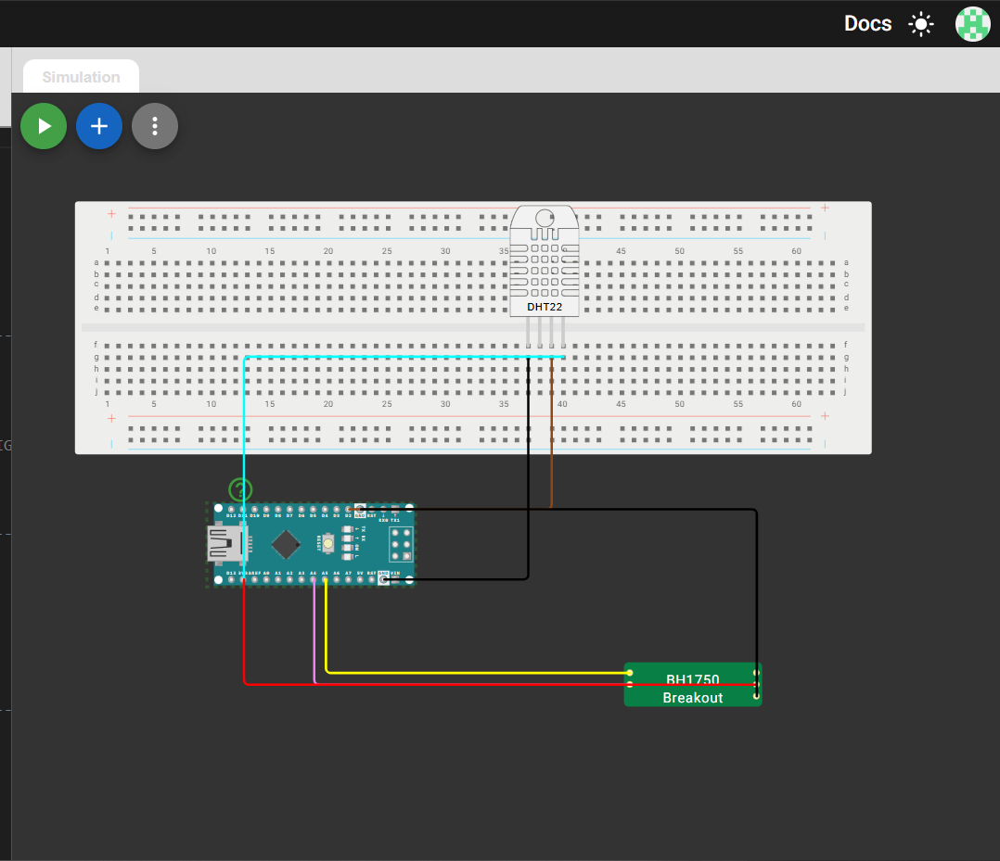
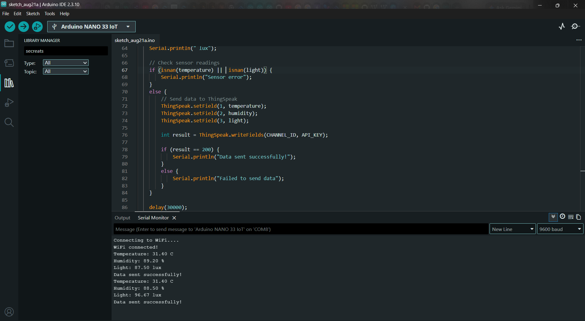
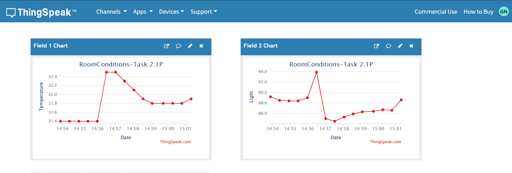

# Task 2.1P - Sending Temperature and Light Data to the Web

## Aim

The aim of this task is to collect temperature, humidity and light
data using sensors and send the data to ThingSpeak over Wi-Fi.

## Components Used

- Arduino board
- DHT22 temperature and humidity sensor
- BH1750 light sensor
- Wi-Fi
- ThingSpeak

## Circuit

The sensors were connected to the Arduino as shown below.

## Arduino Code

The Arduino program reads the temperature, humidity and light
intensity values and sends them to ThingSpeak.

The complete code is available in:

`Task2.1P.ino`

## Serial Monitor

The sensor readings can be observed in the Serial Monitor.

## ThingSpeak Results

The sensor data is uploaded to ThingSpeak and displayed using
graphs.

## Result

The task successfully collected sensor data and transmitted it
to the web using ThingSpeak.
